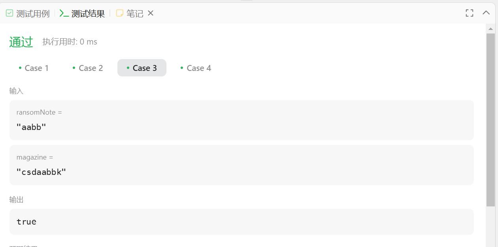
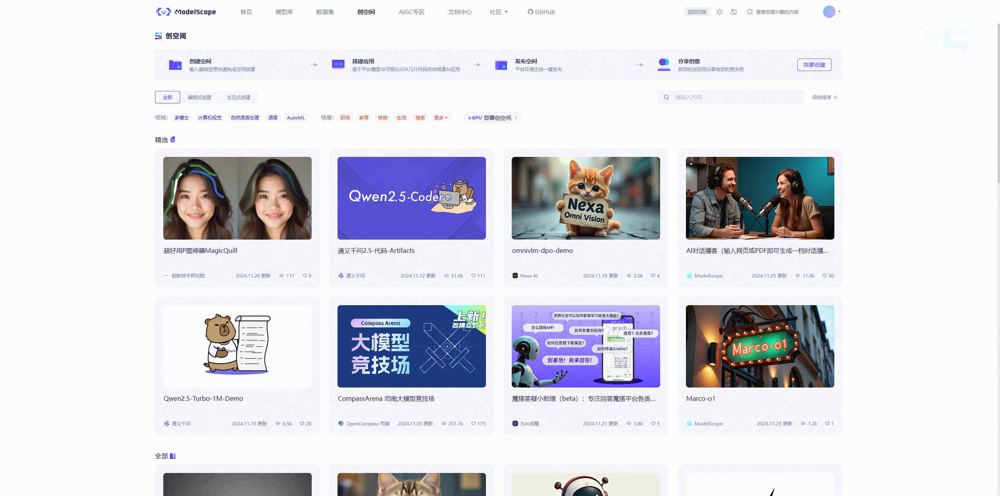

# L0G1000-Python基础

目的：主要就是巩固学习断点调试以及第三方依赖指定路径安装，因为这个基础内容会在后面更高阶的实践得到体验，小伙伴们也可以多多尝试，我发现很多小伙伴们可能还不是很熟悉内容。我们需要注册GitHub账号的，这个建议网上去查阅相关教程，后面会用到OpenXLab浦源平台提供的一些关于数据集获取OpenDataLab、OpenComPass司南评测等平台的使用，所以希望小伙伴们多多了解这些平台及工具的使用，有助于你们更全面的在AI大模型上的成长进步哦~

## Intro

- Conda虚拟环境
- pip安装三方依赖包
- VScode中的Python Debug
- 调用InternLM API
- Python基础语法

我会按照上面的板块分为**教程和task**，肯定是**省流版**！

## 教程

tips：我会添加一些解释说明的

**一、创建conda虚拟环境**

```python
# 创建虚拟新环境
conda create --name lxenv python=3.9
# 激活刚才创建的环境，退出环境则是：conda deactivate。
conda activate lxenv
#查看当前设备上所有的虚拟环境
conda env list
#查看当前环境中安装了的所有包
conda list
#删除环境（比如要删除lxenv）
conda env remove lxenv
```


> **安装虚拟环境到指定目录**
>
> 有时我们会遇到想将整个虚拟环境保存到指定目录来共享，比如在局域网内，或者在InternStudio的团队开发机间共享。此时我们可以把conda的虚拟环境创建到指定目录下。只需要在创建环境时使用`--prefix`参数指定环境所在的文件夹即可，比如我们想在/root/envs/路径下创建刚刚我们创建过得lxenv（只做演示，不需要操作）。
>
> ```python
> conda create --prefix /root/envs/lxenv python=3.9
> conda activate /root/envs/myenv
> ```
>
> myenv这个文件夹里包含了整个虚拟环境，所以理论上将他直接c拷贝到任意一台安装了conda的机器上都能直接激活使用，这也是在内网机器上做环境配置的一种效率较高的解决方案。

**二、pip安装Python相关三方依赖**

pip是Python官方的包管理工具，全称为“Python Package Installer”，用于方便地安装、升级和管理Python包的工具。

```python
pip install <somepackage> # 安装单个包，<somepackage>替换成你要安装的包名
pip install pandas numpy # 安装多个包，如panda和numpy
pip install numpy==2.0 # 指定版本安装
pip install numpy>=1.19,<2.0 # 指定使用版本范围安装
# 安装开源项目中的全部依赖。这个txt文件可查看运行代码所需要包和对应版本信息。
pip install -r requirements.txt 
```


> **安装到指定目录**
>
> 使用pip的时候，可以使用`--target`或`-t`参数来指定安装目录，此时pip会将你需要安装的包安装到你指定的目录下，例如：
>
> ```Python
> # 首先激活环境
> conda activate /root/share/pre_envs/pytorch2.1.2cu12.1
> 
> # 创建一个目录/root/myenvs，并将包安装到这个目录下
> mkdir -p /root/myenvs
> pip install <somepackage> --target /root/myenvs
> 
> # 注意这里也可以使用-r来安装requirements.txt
> pip install -r requirements.txt --target /root/myenvs
> ```
>
> 上面使用的是实战营常用的环境/root/share/pre_envs/pytorch2.1.2cu12.1，下面是在脚本中使用指定目录的Python安装包，可以在python脚本开头临时动态地将该路径加入python环境变量中去。
>
> ```Python
> import sys  
>   
> # 你要添加的目录路径  
> your_directory = '/root/myenvs'  
>   
> # 检查该目录是否已经在 sys.path 中  
> if your_directory not in sys.path:  
>     # 将目录添加到 sys.path  
>     sys.path.append(your_directory)  
>   
> # 现在你可以直接导入该目录中的模块了  
> # 例如：import your_module
> ```


**三、本地vscode连接ssh开发机**

intro：VSCode是由微软开发一款轻量级但功能强大的代码编辑器，开源且完全免费。它拥有丰富的插件生态系统、跨平台支持、以及内置的Git控制功能，为开发者提供了高效便捷的编码体验

VScode下载地址：[Visual Studio Code - Code Editing. Redefined](https://code.visualstudio.com/)

首先安装去插件图标中—搜索栏里搜索“remote-ssh”插件，点击安转即可。


安装好ssh插件后，我们需要本地配置下conig，可以直接在上面正中间的搜索栏搜索输入InternStudio的SSH连接的命令即可，或者自己本地在（C:\Users\xxxxx\ .ssh）里面去配置ssh的命令，记得密码也要复制下，后面会在VScode里面用到的。


当界面**左下角**显示远程连接地址`SSH:ssh.intern-ai.org.cn`时，说明连接成功。此时，我们可以像在本地使用VSCode一样，在开发机上进行各种操作

**五、使用vscode连接开发机进行python debug**

intro：刚开始学习Python编程时，可能会遇到代码不按预期运行的情况。这时，你就需要用到“debug”了。简单来说，“debug”就是能再程序中设置中断点并支持一行一行地运行代码，观测程序中变量的变化，然后找出并修正代码中的错误。而VSCode提供了一个非常方便的debug工具，可以帮助你更容易地找到和修复错误。

这里还是去插件图标里面搜索去安装python，安装对应的插件即可。安转后，写个test.py添加断点测试下，这个就直接用教程里面的计算从start到end-1的全部和运算。

```python
# import debugpy
# debugpy.listen(("localhost", 5678))
# print("等待调试器附加...")
# debugpy.wait_for_client()  # 等待 VS Code 连接

def range_sum(start,end):
    sum_res = 0
    for i in range(start,end):
        sum_res+=i
    return sum_res

if __name__ =="__main__":
    print(range_sum(1,10))
```

> debug面板各按钮功能介绍：
>
> 1. `continue`: 继续运行到下一个断点。
> 2. `step over`: 单步跳过，可以理解为运行当前行代码，不进入具体的函数或者方法。
> 3. `step into`: 单步进入。如果当前行代码存在函数调用，则进入该函数内部。如果当前行代码没有函数调用，则等价于`step over`。
> 4. `step out`: 单步退出函数，返回到调用该函数的上一层代码。
> 5. `restart`: 重新启动调试。
> 6. `stop`: 终止调试。

这里提供两种debug调试的办法

**1.在vscode中使用命令行进行debug**

这里需要再VScode左边的 “RUN AND DEBUG”里面单击"create a lauch.json file"，选择debugger时选择python debuger。选择debug config时选择remote attach就行，随后会让我们选择debug server的地址，因为我们是在本地debug，所以全都保持默认直接回车就可以了，也就是我们的server地址为 **localhost:5678**。

然后我们打开终端输入：

```python
python -m debugpy --listen 5678 --wait-for-client ./text.py
```

然后再去点击debug面板功能的调试

或者我们直接把test.py上面注释部分代码取消注释，直接在终端执行`python test.py`，然后再去debug，其实是一样的，**我们这里要注意的是，调试代码必须要开启一个debug服务启动才可以查看断点设置处的变量值的变化**。


**六、python调用InternLM2.5的API**

首先获取api key，初次使用需要联系小助手要个邀请码。[API文档](https://internlm.intern-ai.org.cn/api/document)

然后再去上面地址创建`api token`，这里一定要注意，浦语的token只有刚创建的时候才能看到全文，后续没法再查看已经创建好的token，如果忘记需要重新创建，所以创建完了以后记得先复制保存到本地。

然后我们创建一个`demo.py`文件，来调用InternLM2.5大模型。

```python
#./internlm.py
from openai import OpenAI
import os
def internlm_gen(prompt,client):
    response = client.chat.completions.create(
        model="internlm2.5-latest",
        messages=[
            {"role": "user", "content": prompt},
      ],
        stream=False
    )
    return response.choices[0].message.content

api_key = os.getenv('api_key')
#api_key = "" #也可以明文写在代码内，不推荐
client = OpenAI(base_url="https://internlm-chat.intern-ai.org.cn/puyu/api/v1/",api_key=api_key)
prompt = '''你好！你是谁？'''
response = internlm_gen(prompt,client)
print(response)
# 设置 api_key的值
export api_key="填入你的api token"
python internlm.py
# 或者直接在 ~/.bashrc 文件中最下面一行添加以下命令（永久生效）
vi /share/.aide/config/bashrc
export api_key="填入你的api token"
source ~/.bashrc
python internlm.py
```


## Task

**一、先来看看LeetCode这道383.赎金信的题目：**

给你两个字符串：`ransomNote` 和 `magazine` ，判断 `ransomNote` 能不能由 `magazine` 里面的字符构成。

如果可以，返回 `true` ；否则返回 `false` 。

`magazine` 中的每个字符只能在 `ransomNote` 中使用一次。

**示例 1：**

```
输入：ransomNote = "a", magazine = "b"
输出：false
```

**示例 2：**

```
输入：ransomNote = "aa", magazine = "ab"
输出：false
```

**示例 3：**

```
输入：ransomNote = "aa", magazine = "aab"
输出：true
```

**提示：**

- `1 <= ransomNote.length, magazine.length <= 105`
- `ransomNote` 和 `magazine` 由小写英文字母组成

简单分析下，就是判断`ransomNote` 能不能由 `magazine` 里面的字符构成，`magazine` 里面的字符只能在`ransomNote` 中使用一次，返回值是布尔类型的。

代码：

```python
class Solution:
    def canConstruct(self, ransomNote: str, magazine: str) -> bool:
        if len(ransomNote) > len(magazine):
            return False        
        count = [0] * 26
        for char in magazine:
            count[ord(char) - ord('a')] += 1
        for char in ransomNote:
            index = ord(char) - ord('a')
            count[index] -= 1
            if count[index] < 0:
                return False
        
        return True
```


分析笔记：定义一个**Solution**类和一个方法 **canConstruct**：该方法接收两个字符串参数 `ransomNote` 和 `magazine`，并返回一个布尔值 (`True` 或 `False`)；然后再用`if`判断检查`ransomNote`字符串的长度是否大于`magazine`字符串的长度，如果满足条件，直接返回`false`；初始化一个长度为 26 的数组 **count**，并将所有元素初始化为 0，这个数组主要是记录`magazine`中每个字符的出现次数，`ord(char) - ord('a') `可以将字符 'a' 到 'z' 映射到数组索引 0 到 25；然后就是`for`循环遍历 `magazine` 字符串，然后统计`char`字符在`magazine`中出现的次数；然后再去遍历 `ransomNote` 字符串，和前面一样用 `ord(char) - ord('a')` 计算 `char` 在数组 count 中的索引，在`count`数组中，在构造`ransomNote` 使用了一个字符则减少一个计数；在最后我们用`if`检查count[index] 是否小于 0，小于就代表`magazine` 中的该字符数量不足以构造 `ransomNote`；最后遍历了 `ransomNote` 中所有的字符，且没有遇到任何字符数量不足的情况，则返回 `True`，表示可以用 `magazine` 中的字符成功构造 `ransomNote`。



**二、调用书生浦语API实现将非结构化文本转化成结构化json的例子，其中有一个小bug会导致报错。请大家自行通过debug功能定位到报错原因并做修正**

改进后的正确代码：

```python
from openai import OpenAI
import json
import os

def internlm_gen(prompt,client):
    '''
    LLM生成函数
    Param prompt: prompt string
    Param client: OpenAI client 
    '''
    response = client.chat.completions.create(
        model="internlm2.5-latest",
        messages=[
            {"role": "user", "content": prompt},
      ],
        stream=False
    )
    return response.choices[0].message.content

# api_key = ''
api_key = os.getenv('api_key')
client = OpenAI(base_url="https://internlm-chat.intern-ai.org.cn/puyu/api/v1/",api_key=api_key)

content = """
书生浦语InternLM2.5是上海人工智能实验室于2024年7月推出的新一代大语言模型，提供1.8B、7B和20B三种参数版本，以适应不同需求。
该模型在复杂场景下的推理能力得到全面增强，支持1M超长上下文，能自主进行互联网搜索并整合信息。
"""
prompt = f"""
请帮我从以下``内的这段模型介绍文字中提取关于该模型的信息，要求包含模型名字、开发机构、提供参数版本、上下文长度四个内容，以json格式返回。
`{content}`
"""
# 模型返回值
res = internlm_gen(prompt,client)
# 去掉代码标识符和无效的json
res_cleaned = res.strip('```json\n').strip('```')
try:
    json_dump = json.dumps(res_cleaned, ensure_ascii=False, indent=4)
    res_json = json.loads(json_dump)
    print(f"输出：{res_json}")
except json.JSONDecodeError as e:
    print(f"JSONDecodeError: {e}")
```

简单描述下原始代码的bng，其实就是大模型输出的`res`的值包含了`代码标识符```json```和json字符`，然后直接调用`json.loads`就会报错，所以这里需要处理下res的值，然后格式化，最后加载输出就可以了，debug调试截图：


简单说明下，我们可以看看设置的断点，左侧可以看到断点处变量的值，通过观察传入传出的变量名的值，很快就能定位到bug的问题所在，申明一下，这里的`api_key`我提前在终端输入，命令`export api_key="填入你的api token"`设置过了，所以我直接使用`os.getenv('api_key')`来获取我的API key，也可以直接在脚本中去指定（不建议明文表示）。

**三、使用VScode连接开发机后使用`pip install -t`命令安装一个numpy到看开发机`/root/myenvs`目录下，并成功在一个新建的python文件中引用。**

直接执行下面代码：

```python
mkdir -p /root/myenvs
cd /root/myenvs
pip install numpy==1.25.0 -t /root/myenvs

touch test.py
# 将下面内容复制到 test.py文件里面去
import sys
# 添加自定义库路径
sys.path.append('/root/myenvs') 

import numpy as np

# 测试 numpy 创建数组函数
print(np.array([1, 2, 3]))

# 直接python 执行 test.py文件
python test.py
```


结果截图如下：


# L0G2000-Git基础

我们首先了解什么是Git，Git支持多人同时开发，保证高效有序，在一个平台上能同步一个项目的开发进度，并且支持历史追踪和版本管理，可以回溯代码。首先了解下面几个基本概念：

**工作区**：本地新建一个目录创建一个Git项目，或者从GitHub上clone代码到本地后，项目所在的这个目录就是“工作区”。

**暂存区**：就是`.git`目录中的一个索引文件，记录了下一次提交时即将要存入仓库的文件列表信息，git add指令可以将工作区的改动存入暂存区。

**仓库/本地仓库**：整个项目的目录，`.git`隐藏目录不属于工作区，而是Git的版本仓库，这个仓库包含了所有历史版本的完整信息。

**Git平台介绍**

`GitHub`：是全球最大的代码托管平台之一，拥有丰富的开源项目和开发者社区

`GitLab`：一个子托管的基于云的平台，提供了完整的DevOps工具链

`Gitee`：国内的代码托管平台，访问速度快，更符合国内的使用习惯。

交作业：

```python
mkdir git
cd git
git clone https://github.com/Dstarjohn/Tutorial.git
cd Tutorial/
git branch -a
git checkout -b class origin/class
git checkout -b class_132
touch 132.md
git add .
git commit -m "add git_camp4_132_introduction" # 提交信息记录,这里需要修改为自己的uid
git push origin class_132
```

132.md的内容需要自己参考教程里面的模板来编写，这里就不贴出来啦。

上面代码截图如下，：


接下来我们可以查看自己fork的仓库页面：


# L0G3000-Linux

参加过多期实战营的小伙伴，教程里面很多内容，相信小伙伴都已经了解了，接下来我就只是稍作补充，想要深入了解的小伙伴可以去看看我前面几期的文章，传送门：[Github详解Linux基础](https://github.com/Dstarjohn/SSPY-Third-Linux-)，顺便也给我点点CSDN的关注呀，传送门：[CSDN博客](https://blog.csdn.net/weixin_44217506?spm=1011.2415.3001.5343)。

**InternStudio开发机**是云端算力平台。主要是为开发者提供了开箱即用的InterLM大语言模型的环境、工具、数据集。

报名参加实战营的同学在填写报名信息的邮箱的时候会收到一个链接地址，用浏览器打开，完成登录即可跳转到控制台界面。

完成实战营的教程会获得大量的算力支持，能满足你日常调试模式和做团队项目的需求。开发机有三种模式：**JupyterLab、Terminal终端、Vscode**

交作业，hello_world.py的文件内容可以直接去教程里面copy，然后本地VScode直接执行即可，截图如下：


详细的linux基础命令和conda创建虚拟环境大家可以参考教程，这里就不在展示了。

# L0G4000-玩转HF/魔塔/魔乐

其实我觉得这个板块的内容我很难提供点什么帮助的，但是训练营很多同学可能还不熟练，也有不断加入的新的小伙伴，唯一建议：多看，多动手实践，不懂的多问，然后坚持下去，一定有所长有所感受。


这是huggingface的model主界面，左上角是很毒品Tasks、Libraries、Language、Licenses的分类，中间就是开源的models，右上方有Models、Datasets、Spaces、等等，直接点进去体验就知道了。

魔塔：



魔乐社区（天翼云打造）


上面是它们的首页，其实感觉都差不多，希望大家多多体验。

交作业：

首先是创建一个py脚本，主要就是用来下载HF模型中文件的

```python
touch hf_download_json.py
# hf_download_json内容如下
import os
from huggingface_hub import hf_hub_download

# 指定模型标识符
repo_id = "internlm/internlm2_5-7b"

# 指定要下载的文件列表
files_to_download = [
    {"filename": "config.json"},
    {"filename": "model.safetensors.index.json"}
]

# 创建一个目录来存放下载的文件
local_dir = f"{repo_id.split('/')[1]}"
os.makedirs(local_dir, exist_ok=True)

# 遍历文件列表并下载每个文件
for file_info in files_to_download:
    file_path = hf_hub_download(
        repo_id=repo_id,
        filename=file_info["filename"],
        local_dir=local_dir
    )
    print(f"{file_info['filename']} file downloaded to: {file_path}")
    
# 运行脚本
python hf_download_josn.py
```


用脚本将模型里面的两个json文件下载到指定目录


在线测试模型的功能：

text.py代码：

```python
import torch
from transformers import AutoTokenizer, AutoModelForCausalLM

tokenizer = AutoTokenizer.from_pretrained("/root/model/internlm2-chat-1_8b", trust_remote_code=True)
model = AutoModelForCausalLM.from_pretrained("/root/model/internlm2-chat-1_8b", torch_dtype=torch.float16, trust_remote_code=True)
model = model.eval()

inputs = tokenizer(["一朵美丽的花"], return_tensors="pt")
gen_kwargs = {
    "max_length": 128,
    "top_p": 0.8,
    "temperature": 0.8,
    "do_sample": True,
    "repetition_penalty": 1.0
}
# 以下内容可选，如果解除注释等待一段时间后可以看到模型输出
output = model.generate(**inputs, **gen_kwargs)
output = tokenizer.decode(output[0].tolist(), skip_special_tokens=True)
print(output)
```


### 总结

希望小伙伴们对这些平台和工具的使用越来越熟悉，多动手实践就知道了，为了能更快的提升能力，大家也可以研究研究模型文件里面的超参数、模型架构、配置文件等说明，更加熟悉，加油！
